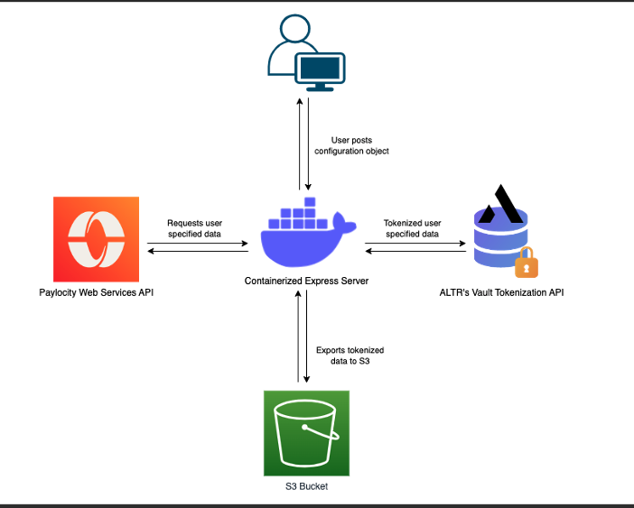

# Tokenize Paylocity Data

ALTR's Open Source integraton with Paylocity allows customers to leverage [ALTR's Vaulted Tokenization](https://docs.altr.com/explore-altr-features/vault-tokenization) to protect sensitive data from [Paylocity's Web Services API](https://prod.cdn.paylocity.com/developer/index.html#t=Topics%2FOverview.htm), while in transit.

Why tokenize data in transit?

- Raw sensitive data will never exist in the data's destination
- Tokenization is more secure than encryption, because a token represents a value without being a function of or derivive of that value
- ALTR can apply role based policy to the tokenized data, to decide who gets to see it and how much they get to see
- Tokenized data retains referential integrity and can still be used for SQL operations like join and group

## Architecture
<hr>



## Necessary Environment Variables:
<hr>

- **domain** - The domain of the Paylocity API (most likely https://api.paylocity.com)
- **company** - Your company's unique ID
- **clientId** - Your Paylocity API key
- **clientSecret** - Your Paylocity API secret
- **mapiKey** - Your ALTR Management API key
- **mapiSecret** - Your ALTR Management API Secret
- **s3Endpoint** - The API Gateway URL for the location the S3 Export data should land
- **s3Key** - The API Key for the s3Endpoint
- **PORT *(optional)*** - The port for the Express server to run on, default is 3000

## Configuration:

A configuration object must be sent to the Express server in the body of an HTTP POST requst, with the following keys:

- **Function** - the value should contain the name of the request to execute
- **Parameters** - an object containing the parameter names and values for the executed request
 - Note: for functions which require Parameter "employee", using "all" in place of an Employee ID will query all employees at once.
- **Tokenize** - an array containing the names of the fields to be tokenized
- **Export** - "true" to export to S3

#### Example:
```
{
    "Function": "getEmployee",
    "Tokenize": ["birthDate", "ssn"],
    "Parameters": {
        "employee": "999890461"
    },
    "Export": "true"
}
```

#### Valid Functions and Required Parameters:
- getPayStatementSummaryByYear: [ 'employee', 'year' ]
- getPayStatementSummaryByYearAndDate: [ 'employee', 'year', 'date' ]
- getPayStatementDetailsByYear: [ 'employee', 'year' ]
- getPayStatementDetailsByYearAndDate: [ 'employee', 'year', 'date' ]
- getEmployee: [ 'employee' ]
- getEmployeeIds: [ 'pageSize', 'pageNumber' ]
- getCompanyCodes: [ 'codeResource' ]
- getCompanySpecificSchema: []
- getCustomFields: [ 'category' ]
- getDirectDeposit: [ 'employee' ]
- getEarnings: [ 'employee' ]
- getEarningsByEarningCode: [ 'employee', 'earningCode' ]
- getEarningsByEarningCodeAndStartDate: [ 'employee', 'earningCode', 'startDate' ]
- getAllLocalTaxes: [ 'employee' ]
- getLocalTaxesByTaxCode: [ 'employee', 'taxCode' ]
- getSensitiveData: [ 'employee' ]

## Additional Resources
<hr>
https://docs.altr.com/

https://www.youtube.com/channel/UCcqDY0wrRlQ8hQ_mjJNfkAA

https://www.altr.com/resources